# 쓰잉 (SSuing) — Design Handoff

> **3문장 영작 습관 학습 앱** · MVP 화면 디자인 패키지
> Designed 2026.04 · Fidelity: **High-fidelity (pixel-perfect)**

---

## 📦 About this package

이 폴더의 HTML/JSX 파일들은 **디자인 레퍼런스**입니다. 프로덕션 코드가 아니라, 최종 앱이 어떻게 보이고 동작해야 하는지를 보여주는 프로토타입입니다.

구현 과제는 **이 디자인을 타겟 코드베이스의 환경(React Native / Flutter / Swift / Kotlin 등)에서 그대로 재현**하는 것입니다. 해당 코드베이스의 기존 컴포넌트 라이브러리, 디자인 토큰 시스템, 네비게이션 패턴을 따르세요. 코드베이스가 아직 없다면 React Native + Expo를 권장합니다 (한국 스타트업 MVP 관례, 빠른 iOS/Android 동시 출시).

### Fidelity
**Hi-fi (pixel-perfect)** — 모든 색상·타이포·간격·애니메이션은 최종 값입니다. 임의로 바꾸지 마시고, 이 문서의 `tokens.json`과 화면별 명세를 따라 구현해주세요.

### 이 패키지에 없는 것
- 백엔드 API 스펙 — 별도 PRD 참조
- 실제 AI 교정 로직 — 프로토타입은 목업 결과 사용
- 다크모드 — 로그인 화면만 다크 톤, 나머지는 라이트

---

## 🗂️ 폴더 구조

```
design_handoff_ssuing/
├── README.md              ← 이 문서
├── tokens.json            ← 디자인 토큰 (색상/타이포/간격/그림자)
├── screenshots/           ← 15개 화면 스크린샷 (PNG)
├── source/                ← 원본 React(JSX) 디자인 파일
│   ├── tokens.js          · TOKENS 전역 객체 정의
│   ├── screens-c-base.jsx · Onboarding 1/3, Login, Terms, History
│   ├── screens-c-v2.jsx   · Home, Practice(Empty/Typing/Submitted), Settings,
│   │                        Onboarding 2/3 · 3/3
│   ├── screens-c-v3.jsx   · Practice(Grading/Result), DailyComplete,
│   │                        LevelUp, StreakPlus
│   ├── prototype-flow.jsx · 15개 화면 노드 그래프 + 핫스팟 좌표
│   └── ios-frame.jsx      · iPhone 15 Pro 프레임 (402×874)
└── (prototype.html은 프로젝트 루트에 있음 — 브라우저로 열어 실제 인터랙션 확인)
```

---

## 🎨 Design Tokens

`tokens.json` 참조. 요약:

### Colors — Brand & Semantic
| Token | Hex | Usage |
|---|---|---|
| `brand.primary` | `#4A90D9` | 주요 CTA, 일상 영어 테마, 링크 |
| `brand.primaryDeep` | `#2E6DB3` | 프레스 상태, hero 텍스트 강조 |
| `brand.primarySoft` | `#E8F1FB` | 라이트 배경, hover |
| `brand.secondary` | `#7C4DFF` | 비즈니스 테마 |
| `brand.secondarySoft` | `#EFE9FF` | 비즈 테마 배경 |
| `status.success` | `#22C55E` | 교정 통과, 완료 |
| `status.warning` | `#F59E0B` | 스트릭 강조, 온보딩 3/3 |
| `status.error` | `#EF4444` | 교정 실패, 오류 |
| `theme.travel` | `#10B981` | 여행 영어 테마, 온보딩 2/3 |
| `onboarding.purple` | `#4F46E5` | 온보딩 1/3 배경 |
| `onboarding.green` | `#10B981` | 온보딩 2/3 배경 |
| `onboarding.amber` | `#F59E0B` | 온보딩 3/3 배경 |

### Colors — Surface & Text
| Token | Hex | Usage |
|---|---|---|
| `surface.bg` | `#FAFBFC` | 앱 최외곽 배경 |
| `surface.surface` | `#FFFFFF` | 카드 |
| `surface.surfaceAlt` | `#F4F5F7` | 입력창, 보조 표면 |
| `surface.border` | `#EAECEF` | 카드 외곽선 |
| `text.primary` | `#1A1A2E` | 본문, 제목 |
| `text.secondary` | `#6B7280` | 보조 텍스트 |
| `text.hint` | `#9CA3AF` | 힌트, 플레이스홀더 |

### Typography — Pretendard Variable
웹폰트 CDN: `https://cdn.jsdelivr.net/gh/orioncactus/pretendard@v1.3.9/dist/web/static/pretendard.css`
iOS/Android에서는 [Pretendard 공식 저장소](https://github.com/orioncactus/pretendard)에서 정적 폰트 파일을 번들하세요.

| Style | Size | Weight | LineHeight | LetterSpacing | Usage |
|---|---|---|---|---|---|
| `display` | 44 | 900 | 1.1 | -1.5 | Daily Complete "3문장 완성" |
| `h1` | 28 | 800 | 1.2 | -0.8 | 홈 인사말, 온보딩 타이틀 |
| `h2` | 22 | 800 | 1.25 | -0.5 | 섹션 헤더 |
| `h3` | 18 | 800 | 1.3 | -0.4 | 카드 타이틀 |
| `body` | 15 | 500 | 1.5 | 0 | 본문 |
| `bodySmall` | 13 | 500 | 1.5 | 0 | 보조 본문 |
| `caption` | 11 | 600 | 1.3 | 0.3 | 메타 정보 |
| `label` | 10 | 800 | 1.2 | 1.2 | 상단 레이블 (`01 · DAILY HABIT`) |

### Spacing (px)
`[0, 4, 8, 12, 16, 20, 24, 32, 40, 48, 64]` — 8pt base, 화면 가장자리 패딩은 20 고정

### Radius (px)
| Token | Value | Usage |
|---|---|---|
| `xs` | 8 | 작은 뱃지 |
| `sm` | 12 | 보조 버튼, 입력창 |
| `md` | 16 | 기본 카드 |
| `lg` | 20 | 큰 카드 |
| `xl` | 24 | Hero 카드, 모달 |
| `xxl` | 28 | 전체 화면 다이얼로그 |
| `pill` | 999 | 뱃지, 태그, 원형 버튼 |

### Shadow
| Token | Value |
|---|---|
| `sm` | `0 2px 8px -2px rgba(0,0,0,0.08)` |
| `md` | `0 8px 24px -8px rgba(0,0,0,0.12)` |
| `lg` | `0 16px 32px -8px rgba(0,0,0,0.15)` |
| `primary` | `0 16px 32px -8px rgba(74,144,217,0.4)` — 퍼라이머리 CTA 전용 |

---

## 📱 화면 일람 (15 screens)

모든 화면은 **iPhone 15 Pro viewport: 402 × 874 px** 기준으로 디자인됨 (Dynamic Island 62px + 홈 인디케이터 34px 포함).

| # | Screen | File | Route | Purpose |
|---|---|---|---|---|
| 1 | Onboarding 1/3 | `screens-c-base.jsx:Onboarding` | `onb1` | 앱 소개 — 퍼플 |
| 2 | Onboarding 2/3 | `screens-c-v2.jsx:Onb2` | `onb2` | AI 교정 가치 — 그린 |
| 3 | Onboarding 3/3 | `screens-c-v2.jsx:Onb3` | `onb3` | 3문장 습관 — 앰버 |
| 4 | Login | `screens-c-base.jsx:Login` | `login` | 소셜 로그인 (다크) |
| 5 | Terms | `screens-c-base.jsx:Terms` | `terms` | 약관 동의 |
| 6 | Home | `screens-c-v2.jsx:Home` | `home` | XP 카드 + 테마 리스트 |
| 7 | Practice · Empty | `screens-c-v2.jsx:PracticeEmpty` | `p_empty` | 작문 전 — 한글 프롬프트 |
| 8 | Practice · Typing | `screens-c-v2.jsx:PracticeTyping` | `p_typing` | 작문 중 — 라이브 힌트 |
| 9 | Practice · Grading | `screens-c-v3.jsx:PracticeGrading` | `p_grading` | AI 분석 3단계 로더 |
| 10 | Practice · Result | `screens-c-v3.jsx:PracticeResult` | `p_result` | diff 하이라이트 + 설명 |
| 11 | Daily Complete | `screens-c-v3.jsx:DailyComplete` | `daily_done` | 3문장 완수 리워드 |
| 12 | Level Up | `screens-c-v3.jsx:LevelUp` | `levelup` | 레벨 모달 |
| 13 | Streak +1 | `screens-c-v3.jsx:StreakPlus` | `streak` | 연속 달성 축하 |
| 14 | Settings | `screens-c-v2.jsx:Settings` | `settings` | 푸시/리마인더 설정 |
| 15 | History | `screens-c-base.jsx:History` | `history` | 문장 기록 테이블 |

---

## 🔀 Navigation Flow

```
                 ┌──── onb1 ──→ onb2 ──→ onb3 ──┐
                 │                               ↓
                 │          (skip from any)    login ──→ terms ──→ HOME
                 │                               │                    │
                 └─ (guest) ─────────────────────┘                    │
                                                                      │
   ┌─────────────── HOME (hub) ──────────────────────────────────────┘
   │                │              │           │
   ↓                ↓              ↓           ↓
 settings         streak         history    p_empty
   │                │              │           ↓
   ↓                │              │        p_typing
 login              ↓              ↓           ↓
(로그아웃)       HOME           p_result ←  p_grading
                                   │           │
                                   │           ↓
                                   │        p_result
                                   │           │
                                   │           ↓
                                   │       (3/3 완료?)
                                   │         ↓        ↓
                                   │      p_empty  daily_done
                                   │                   │
                                   │                   ├─→ levelup → streak → HOME
                                   │                   ├─→ HOME
                                   │                   └─→ p_empty
                                   └──→ (카드 탭) p_result (재검토)
```

**Key paths**
- **신규 가입**: `onb1 → onb2 → onb3 → login → terms → home`
- **일일 학습**: `home → p_empty → p_typing → p_grading → p_result → (반복 3회) → daily_done → home`
- **리워드**: `daily_done → levelup → streak → home` (레벨업 발생 시)
- **회원 설정**: `home → settings → home` (toggle), `settings → login` (로그아웃/탈퇴)
- **기록 재검토**: `home → history → p_result (read-only) → (뒤로) → history`

---

## 🎯 Screen-by-screen specs

### 1. Onboarding 1/3 — `onb1`
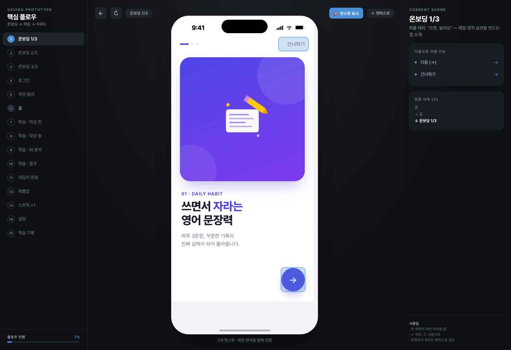
- **목적**: 앱 첫 인상. "쓰면, 늘어요" 핵심 가치 전달
- **레이아웃**: 상단 프로그레스 3칸 / 우상단 "건너뛰기" / 중앙 히어로 일러스트 카드 (purple `#4F46E5`, radius 28, 높이 300) / 레이블 `01 · DAILY HABIT` / 타이틀 `쓰면서 자라는 / 영어 문장력` (h1 28, "자라는"은 primary blue) / 서브카피 (body 15, textSec) / 우하단 원형 다음 버튼 (56×56 primary, radius pill)
- **인터랙션**: 다음 탭 → `onb2` / 건너뛰기 탭 → `login`
- **하드코드 카피**: 위에 기재

### 2. Onboarding 2/3 — `onb2`
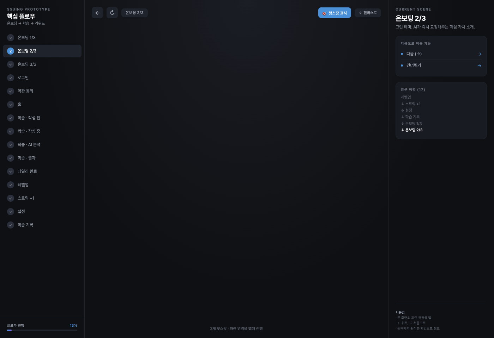
- **목적**: AI 즉시 교정이라는 차별점 전달
- **레이아웃**: onb1과 동일 구조, 히어로 색상 green `#10B981`, 프로그레스 2/3, 레이블 `02 · AI COACH`, 타이틀 강조 단어 green

### 3. Onboarding 3/3 — `onb3`

- **목적**: "하루 3문장이면 충분" 부담 낮추기
- **레이아웃**: 히어로 amber `#F59E0B`, 레이블 `03 · 3 SENTENCES / DAY`, CTA가 원형이 아닌 **풀너비 "시작하기" 버튼** (342×56, primary, radius 16) — 마지막이라 시작 의도를 명확히 보여야 함

### 4. Login — `login`
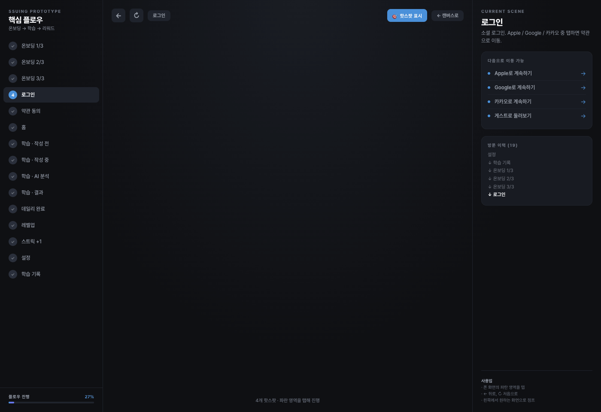
- **목적**: 계정 생성 장벽 최소화
- **레이아웃**: **다크 배경** (이 화면만 예외) / 중앙 로고 + 태그라인 / 하단 3개 버튼 스택: Apple(검정 334×50), Google(흰색+검정 테두리 334×50), 카카오(노랑 334×50 `#FEE500` + 갈색 아이콘) / 하단 "게스트로 둘러보기" 텍스트 링크
- **인터랙션**: Apple/Google/카카오 → `terms` / 게스트 → `home` (온보딩된 임시 상태)

### 5. Terms — `terms`
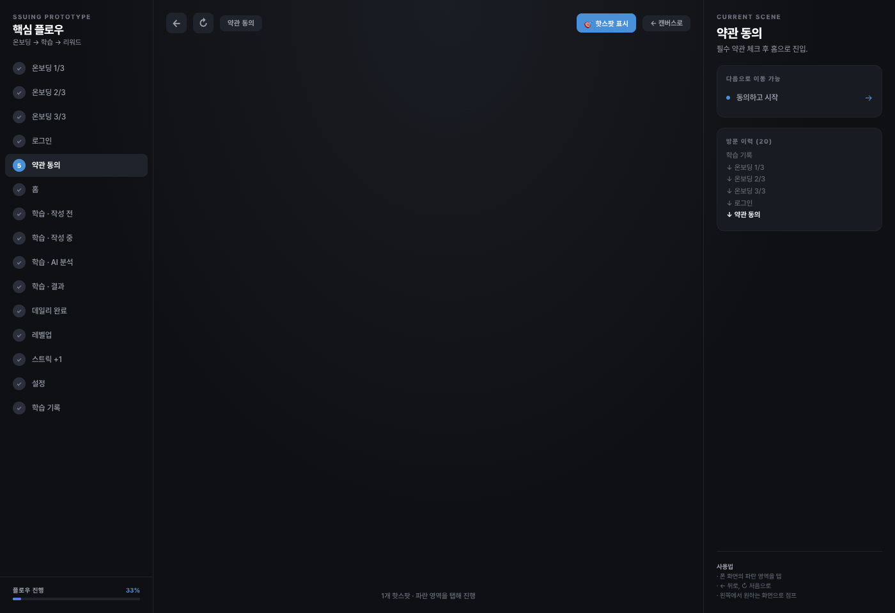
- **목적**: 최소 필수 동의
- **레이아웃**: 상단 "약관 동의" 타이틀 / 전체 동의 체크박스 / 필수 항목 3개 (이용약관, 개인정보, 만 14세 이상) / 선택 항목 1개 (마케팅 수신) / 하단 "동의하고 시작" CTA (342×50, disabled until 필수 완료)
- **인터랙션**: 동의하고 시작 → `home`

### 6. Home — `home`
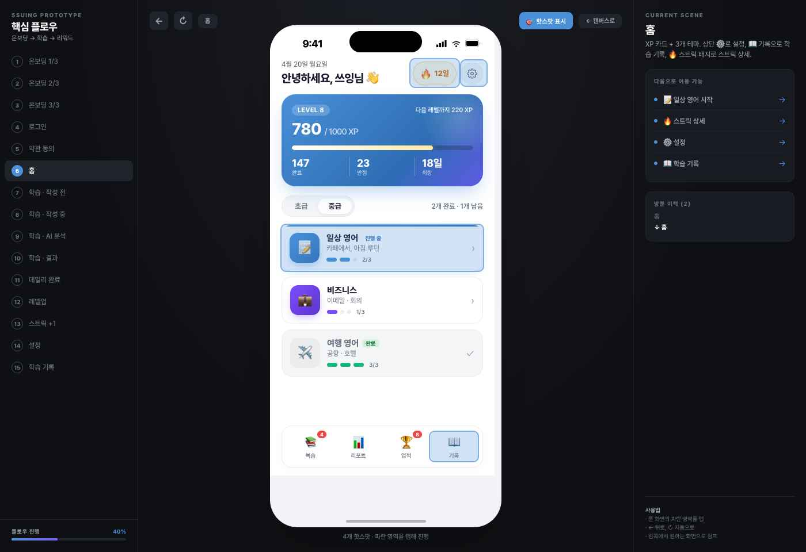
- **목적**: 오늘 할 일 + 진행 현황 한눈에
- **레이아웃**:
  - 상단 바: 날짜 caption + 인사말 h1 "안녕하세요, 쓰잉님 👋" / 우측 🔥 스트릭 뱃지 (pill, 주황 외곽선, "12일") / ⚙️ 설정 아이콘
  - **Hero XP 카드** (350×172, radius 20, linear-gradient `#4A90D9 → #2E6DB3`, shadow.primary): LEVEL 8 레이블 / "780 / 1000 XP" (display 44, white) / "다음 레벨까지 220 XP" / 프로그레스 바 8px / 3개 스탯 (누적 147, 연속 23일, 최장 18일)
  - **탭 세그먼트**: 초급 | 중급 (중급 활성, white pill bg)
  - **테마 카드 3개** (각 350×80, radius 16):
    - 일상 영어 (active, `#E8F1FB` bg, "진행 중" 배지, 2/3, primary border)
    - 비즈니스 (inactive, white, 1/3)
    - 여행 영어 (disabled, "완료" 배지, 체크 아이콘)
  - **하단 퀵 액세스** 4개 아이콘 + 레이블 (복습4·리포트·업적6·기록): 일반 탭바 아님 — Home에만 있는 장식적 도구 모음
- **인터랙션**: 일상 카드 → `p_empty` / 🔥 → `streak` / ⚙️ → `settings` / 기록 → `history`

### 7. Practice · Empty — `p_empty`

- **목적**: 작문 시작 전 프롬프트 제시
- **레이아웃**: 상단 ← 뒤로 / "문장 1 / 3" 카운터 / 프롬프트 카드 (한글 지문, 힌트 단어 3개 chip) / 빈 입력 영역 / 하단 "작문 시작" CTA (350×52, primary)

### 8. Practice · Typing — `p_typing`
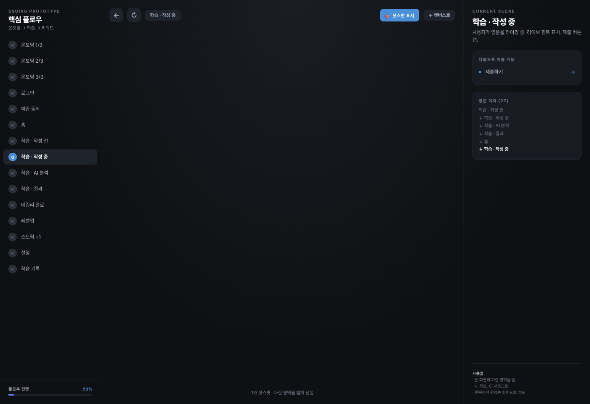
- **목적**: 타이핑 중 실시간 힌트 + 제출
- **레이아웃**: 상단 동일 / 타이핑 중인 영문 (primary cursor) / 글자수 카운터 / 하단 "제출하기" CTA (활성 primary)

### 9. Practice · Grading — `p_grading`
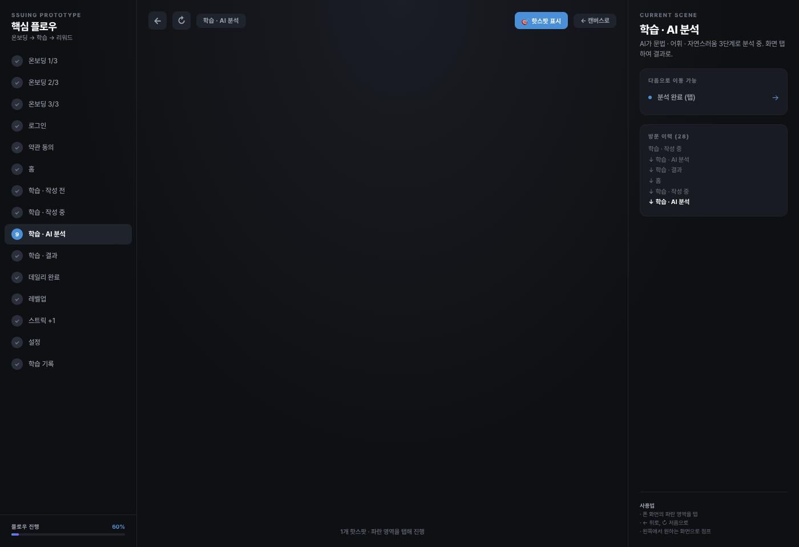
- **목적**: AI 분석 중임을 보여주는 로딩 — 기대감 조성
- **레이아웃**: 3단계 체크리스트 ("문법 검사 ✓" / "어휘 분석 ✓" / "자연스러움 판정 ···") — 0.8s 간격 순차 체크 / 중앙 원형 프로그레스 spinner (primary)
- **인터랙션**: 완료 후 자동 전환 OR 탭 시 `p_result`

### 10. Practice · Result — `p_result`
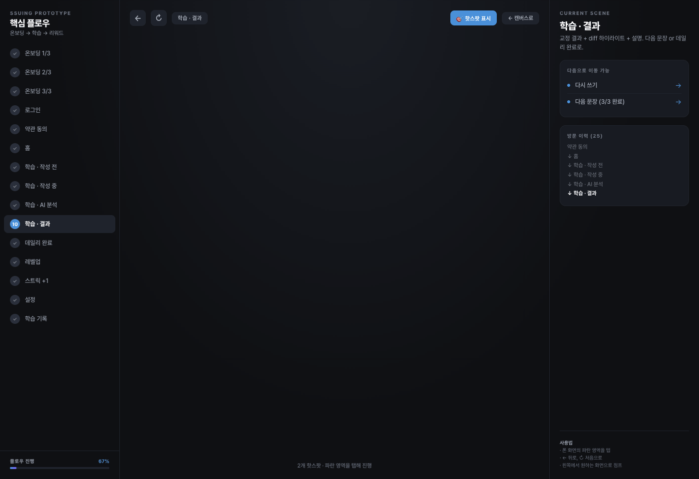
- **목적**: 교정 결과 + diff + 설명 전달
- **레이아웃**: 스코어 배지 (우상단 86점 success green) / 원문 (user input) / 교정문 (diff 하이라이트: 삭제는 strikethrough `#EF4444`, 추가는 bold `#22C55E`) / 코치 설명 카드 (radius 16, surfaceAlt) / 하단 2버튼: "다시 쓰기" (119×48, secondary) + "다음 문장 →" (223×48, primary)

### 11. Daily Complete — `daily_done`
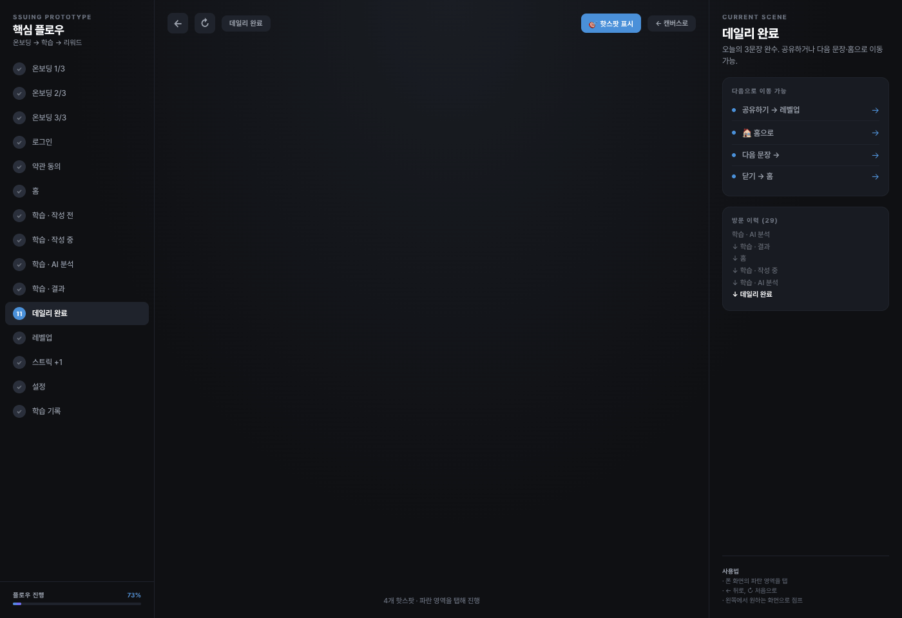
- **목적**: 하루 3문장 완수 축하 — 리텐션 핵심
- **레이아웃**: 중앙 display "3문장 완성" / 오늘의 하이라이트 stat 카드 3개 (획득 XP, 평균 점수, 소요 시간) / 하단 "공유하기" CTA + 보조 "🏠 홈으로" / "다음 문장 →" 2버튼 / 우상단 ✕

### 12. Level Up — `levelup`

- **목적**: 레벨 상승 모달 — 보상 강조
- **레이아웃**: 전체 모달 (dim bg 70% black), 중앙 다이얼로그 (radius 28) / "LEVEL 9" 뱃지 / "🎉 레벨 업!" / 잠금 해제된 기능 안내 / "계속하기" CTA 292×50

### 13. Streak +1 — `streak`
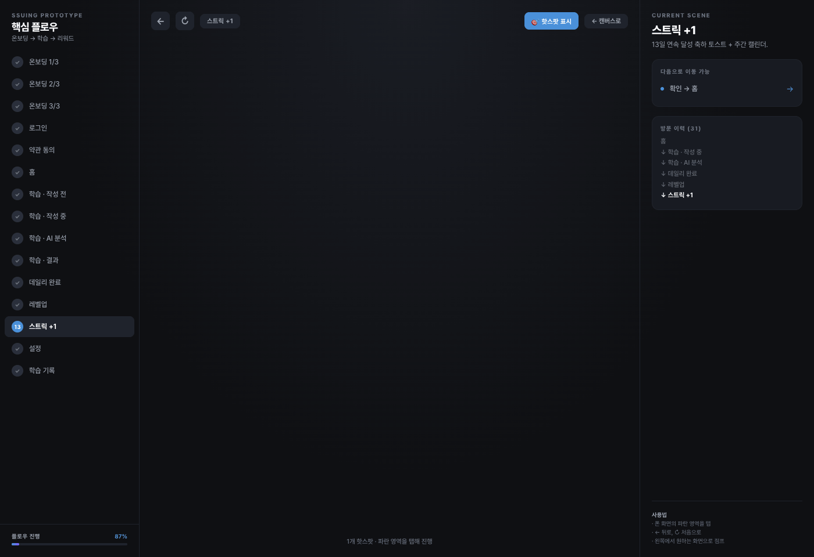
- **목적**: 연속 달성 가시화
- **레이아웃**: 상단 🔥 이모지 큰 크기 (display) / "13일 연속!" h1 / 주간 캘린더 (7개 원, 오늘까지 채워짐 orange gradient, 오늘은 pulse) / 최장 기록 비교 stat / "확인" CTA

### 14. Settings — `settings`

- **목적**: 알림 설정 + 계정
- **레이아웃**: ← 뒤로 / 섹션 "알림" (푸시 알림 toggle, 리마인더 시간 picker) / 섹션 "계정" (이메일 readonly, 버전) / 하단 위험 영역: 로그아웃 (secondary, 166×41) / 회원 탈퇴 (destructive 빨강 외곽선, 168×41)

### 15. History — `history`
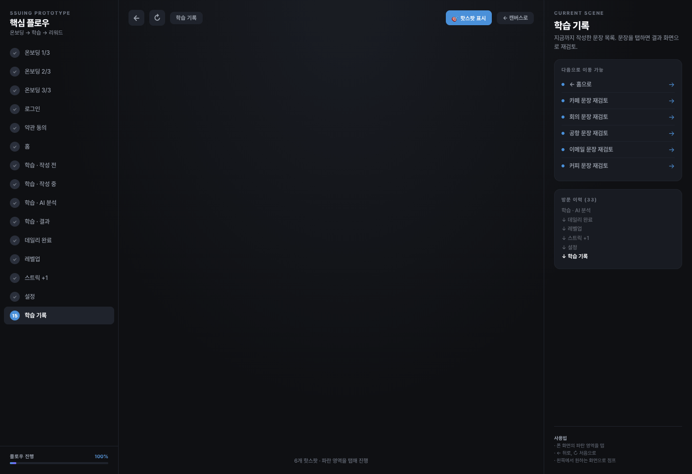
- **목적**: 과거 문장 검토 (스캔 효율성 중시 → 카드 아닌 테이블 느낌)
- **레이아웃**: ← 뒤로 / 월별 필터 chips / 문장 리스트 (각 342×66, radius 12): 날짜 caption + 한글 프롬프트 요약 + 점수 배지
- **인터랙션**: 항목 탭 → `p_result` (read-only 모드)

---

## 🔁 Interactions & Animations

### Global
- **화면 전환**: iOS push 스타일 (우측에서 slide-in 250ms ease-out). `history → p_result`는 모달 스타일 (하단에서 slide-up).
- **버튼 press**: scale(0.96) + opacity 0.8, 100ms.
- **탭 리플**: Android는 ripple, iOS는 opacity overlay 10%.

### Home
- **XP 프로그레스 바**: 화면 진입 시 0% → 78% 1.2s `cubic-bezier(0.4, 0, 0.2, 1)`.
- **XP 숫자 카운트업**: 0 → 780 1.2s 동기화.

### Practice · Grading
- 3단계 체크리스트: 각 단계 0.8s 간격으로 check 아이콘 pop-in (scale 0 → 1.2 → 1).
- 마지막 체크 완료 300ms 뒤 자동으로 Result 화면 pre-fetch.

### Practice · Result
- diff 하이라이트: 등장 시 각 토큰 100ms stagger fade-in.
- 점수 배지: count-up 0 → 86, 0.8s.

### Daily Complete
- Display 텍스트 fade + slide-up 400ms.
- 3개 stat 카드 100ms stagger.
- Confetti burst (1회, 2s, fade-out).

### Level Up
- 모달 dim fade 200ms + 다이얼로그 scale 0.8 → 1 spring (stiffness 300).
- LEVEL 뱃지 pulse 무한 (2s ease-in-out).

### Streak +1
- 🔥 이모지 bounce 1회 (400ms).
- 주간 캘린더 원 fade-in stagger 50ms, 오늘 원 pulse.

---

## 🧩 Common Components (to build once, reuse everywhere)

| Component | Props | Used in |
|---|---|---|
| `<ThemeCard>` | `theme: 'daily'\|'biz'\|'travel'`, `status: 'active'\|'inactive'\|'done'`, `progress` | Home |
| `<StatPill>` | `label`, `value`, `accent?` | Home, DailyComplete |
| `<ScoreBadge>` | `score: 0-100` (색상 자동: ≥80 success, ≥60 warning, else error) | Result, History |
| `<DiffText>` | `original`, `corrected` → tokenize & render | Result |
| `<ProgressBar>` | `value: 0-1`, `gradient?: boolean` | Home, Onboarding top |
| `<StreakBadge>` | `days` | Home top bar |
| `<CTAButton>` | `variant: 'primary'\|'secondary'\|'destructive'`, `fullWidth?` | 전역 |
| `<Chip>` | `label`, `selected?` | History filter, Hint words |
| `<SocialLoginButton>` | `provider: 'apple'\|'google'\|'kakao'` | Login |

---

## 🗃️ State Management (suggested shape)

```ts
type User = {
  id: string;
  nickname: string;
  level: number;
  xp: number;
  xpToNext: number;
  streak: { current: number; max: number; weeklyProgress: boolean[] };
  stats: { totalSentences: number; consecutiveDays: number; longestStreak: number };
};

type Theme = {
  id: 'daily' | 'biz' | 'travel';
  progress: number;  // 0-3
  locked: boolean;
};

type Sentence = {
  id: string;
  date: string;
  themeId: Theme['id'];
  promptKo: string;
  userInput: string;
  corrected: string;
  score: number;
  diff: Array<{ type: 'same'|'add'|'remove'; text: string }>;
  explanation: string;
};

type Settings = {
  pushEnabled: boolean;
  reminderTime: string; // "HH:mm"
};
```

---

## 🧪 Running the prototype locally

Node 없이도 확인 가능:
1. 이 폴더와 프로젝트 루트의 `prototype.html`, `index.html`, 그리고 모든 `screens-*.jsx`, `tokens.js`, `ios-frame.jsx`, `prototype-flow.jsx`를 동일한 폴더에 둔다.
2. 로컬 정적 서버로 열기: `python3 -m http.server 8080` 후 `http://localhost:8080/prototype.html`
3. 왼쪽 사이드바에서 화면 이동 / 우상단 "핫스팟 표시" 토글로 탭 가능 영역 확인

---

## 📋 Implementation checklist

- [ ] `tokens.json` → 타겟 플랫폼의 디자인 토큰 시스템으로 이식 (Tailwind config, Flutter theme, SwiftUI Color/Font extensions 등)
- [ ] Pretendard 폰트 번들
- [ ] 공통 컴포넌트 9종 구현 (위 표)
- [ ] 15개 화면 구현 — 스크린샷 기준
- [ ] 네비게이션 그래프 (위 Flow 다이어그램)
- [ ] 애니메이션 7종 (Global + Home XP + Grading + Result + Daily + LevelUp + Streak)
- [ ] 백엔드 연동 (PRD 별도)

---

## ❓ Open questions for the developer

이 디자인 단계에서 정하지 않은 것들 — PM과 확정 후 구현:
1. **다크 모드 전면 지원 여부** — 현재는 Login 화면만 다크. 시스템 설정 연동 시 모든 화면 다크 variant 추가 필요.
2. **Tablet/iPad 지원** — 현재 402×874 고정. 태블릿에서는 중앙 정렬 + max-width 440 권장.
3. **접근성** — VoiceOver 라벨, 동적 타입 지원, 색상 대비(diff 하이라이트는 색만으로 구분하지 말 것 — 아이콘 병행 필요).
4. **오프라인 동작** — 작성 중 끊길 경우 로컬 저장 후 복귀 시 복원?
5. **Practice Grading 실패 시** — 에러 상태 화면이 아직 별도 정의되지 않음. 현재 `screens-c-v2.jsx`에 `ErrorState` placeholder 존재.

---

Questions during implementation? 이 패키지 원본 Claude 프로젝트로 돌아와서 물어보세요 — 디자인 의도와 히스토리가 거기 남아있습니다.
